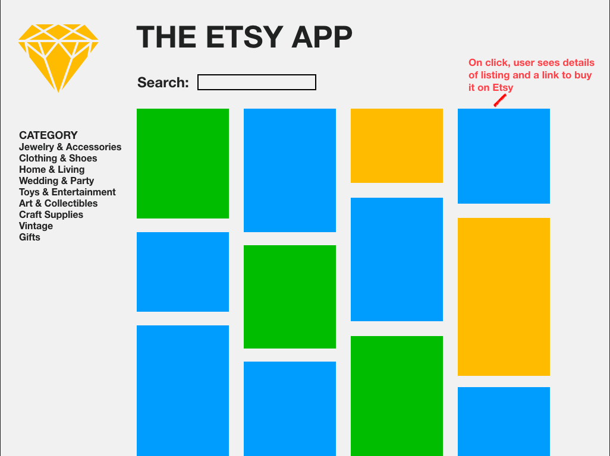

<p "float: center">
  
</p>

# [EtsyBoard](https://etsy-board.herokuapp.com/)

## EtsyBoard is a place to visually explore the listings on Etsy. Browse dynamically by category or searchbar; view cover photos; and click for more information, the price, and a link to its page on Etsy.

## This app was built with React and pulls from the [Etsy API](https://www.etsy.com/developers/). It employs React Router and has six components.

### I was inspired by Pinterest for the design, and felt that keeping it simple was the best approach. Small UX details like the hover change on the sidebar categories and the 'flip' effect on the listings make it easy for users to see interactivity. I created the logo from scratch, and I used media queries to make the app responsive.

### Next, I would like to add a 'favorites' feature that allows users to add listings to a page where they can view their favorite listings. I would also like for users to be able to share listings to social media. Additionally, I will make the app more responsive by moving the sidebar into a drop-down menu for mobile, so that the listings span the entire page.

### Here is a code snippet that I used for the "clothing" category in the sidebar using async and await:
```javascript
  async clothingCat(e) {
    e.target.style.fontWeight = 'bold'
    await this.setState({ category: ", clothing, shoes" })
    this.getListings()
  }
```

### Here is my original idea wireframe:
<p "float: center">
  
</p>
